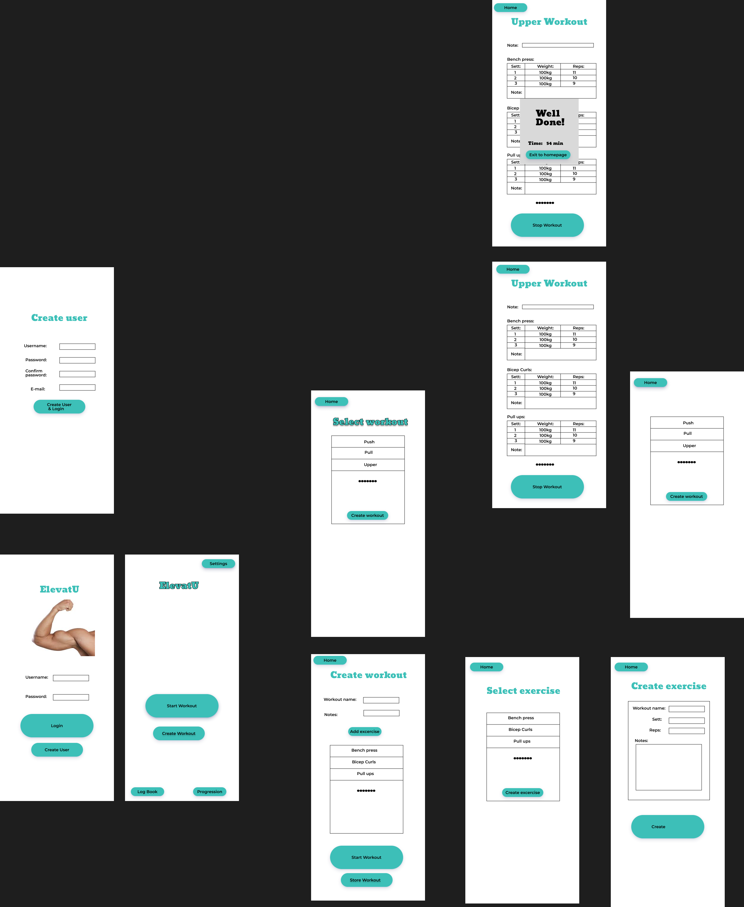

# Release 1
In release one have we wanted to implement a core functionality of the application, which is to create and store login information for the user. In the finished application the login information will be used to allow users to acces their training sessions and plans on multiple devices.

As of release 1, the application allows the user to create an user. 
Their credentials are then saved using JSON. To avoid exposing raw text passwords
(which would be a huge security risk), the passwords are hashed using SHA-512 as well as salted for extra security. The username, password and hash are then stored in the file. When logging in, we compare the hashed password with a hashed version of whatever the user has entered (using the saved salt).

All logic features of the applications are tested using automatic tests using JUnit5.

## Functionality

Important to be able to do:
    - Log in
    - Save user information

Work on basic structures allowing the user to 'save my workout sessions' was also started.

## Conceptual Model

## Current plan for the app
